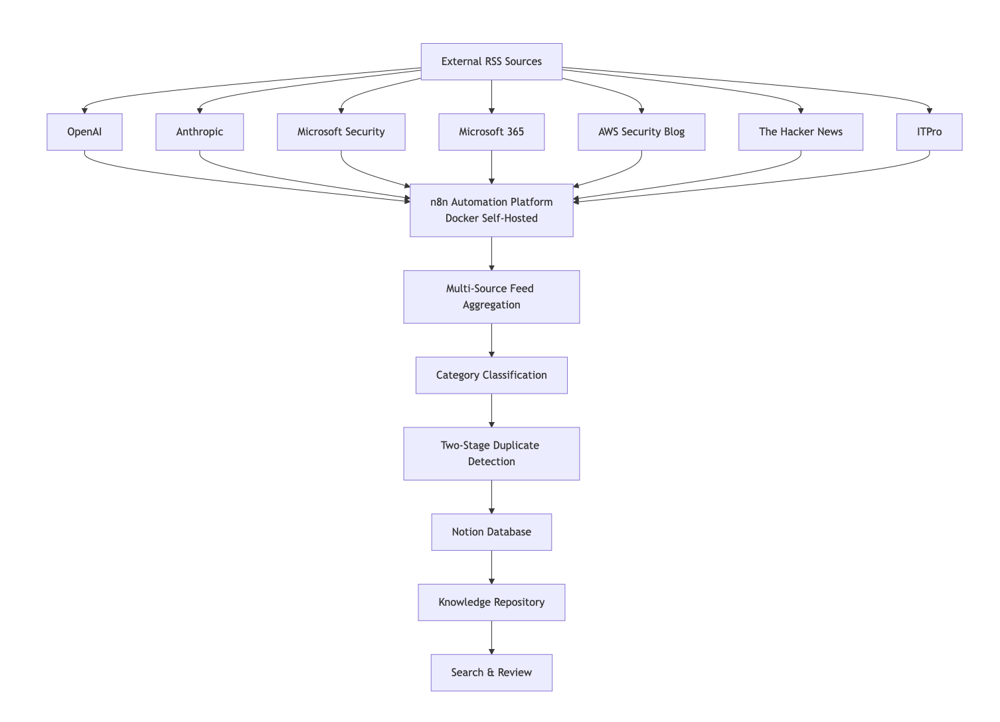

# AI-Powered Technology Intelligence Hub

An automated workflow that eliminates manual technology news monitoring by aggregating, deduplicating and organising content from multiple sources into a centralised Notion knowledge hub.

## Overview

Before building this solution, staying current with technology, AI and cybersecurity news required manually checking multiple websites and newsletters each morning. This process typically took approximately 20–30 minutes per day and often resulted in duplicate information from different sources.

To streamline this process, I designed and implemented a self-hosted automation platform using n8n, Docker, Notion and AI summarisation. The workflow automatically collects articles from multiple RSS feeds, removes duplicates, generates concise AI summaries and stores structured records in a searchable knowledge repository.

## Architecture

## Technologies Used

- n8n (Workflow Automation)
- Docker (Self-Hosted Environment)
- Notion API
- OpenAI API
- RSS Feeds
- JavaScript
- Workflow Automation

## Workflow Features

### Multi-Source Aggregation

Automatically collects articles from multiple technology, AI and cybersecurity sources including:

- OpenAI
- Anthropic
- Microsoft Security
- Microsoft 365
- AWS Security Blog
- The Hacker News
- ITPro

### Two-Stage Duplicate Detection

To prevent duplicate records:

1. Duplicate RSS entries are removed before processing.
2. Incoming articles are validated against existing Notion records before creation.

### AI Summarisation

New articles are cleaned and passed to an AI model to generate concise summaries before being stored in Notion.
This makes the knowledge hub easier to scan, search and review.

### Knowledge Management

All content is stored in Notion with:

- Title
- Source
- URL
- Publication Date
- Category

This creates a searchable and centralised technology intelligence repository.

## Technical Challenges

### Duplicate Prevention

The most complex challenge was duplicate management.

The initial design queried Notion for every article individually. While functional, this approach became inefficient as the database grew.

The workflow was redesigned to:

- Retrieve existing article links once per execution
- Build an in-memory reference list
- Compare incoming articles against that list
- Process only unique records

This significantly improved efficiency and eliminated duplicate entries.

### AI Summary Content Mapping

Another challenge was ensuring the AI model received the correct article content.

Different RSS sources returned article text in different fields, such as content, contentSnippet, content:encoded and content:encodedSnippet. Some feeds only provided a short snippet, while others included the full article body.

To resolve this, I added a content-cleaning step that:

- Selects the best available article content field
- Removes unnecessary HTML formatting
- Standardises the content into a consistent cleanContent field
- Passes the cleaned article text to the AI summarisation step

This improved summary accuracy and made the workflow more reliable across different RSS sources.

## Results

- Reduced manual news review time from approximately 20–30 minutes per day to near zero
- Automated monitoring across 7+ information sources
- Generated AI summaries for new articles automatically
- Centralised technology, AI and cybersecurity intelligence in a single location

## Workflow Screenshot

## Future Enhancements

- AI-assisted importance and impact scoring
- Trend analysis and topic clustering
- Enhanced categorisation and tagging
- Additional business and technology intelligence sources

---