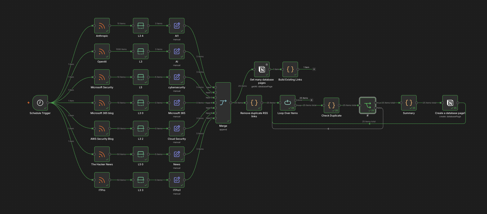

# AI-Powered-Technology-Intelligence-Hub

An automated workflow that eliminates manual technology news monitoring by aggregating, deduplicating and summarising content from multiple sources into a centralised Notion knowledge hub.

## Problem

Staying current with technology, AI and cybersecurity news required checking 7+ websites and newsletters manually every morning - taking roughly 20-30 minutes daily with inconsistent coverage and duplicate content across sources.

## Solution

A self-hosted n8n automation pipeline that runs on a schedule, collects articles from multiple RSS feeds, checks for duplicates, generates AI summaries and stores everything in Notion automatically.

## Tools Used

- n8n - workflow automation (self-hosted via Docker)
- Docker - local hosting environment
- Notion - centralised knowledge hub and database
- RSS feeds - OpenAI, Anthropic, Microsoft Security, AWS Security, The Hacker News, ITPro and more
- AI summarisation - automated article summaries via integrated AI model

## How It Works

1. Workflow triggers on a schedule
2. Pulls latest articles from 7+ RSS sources
3. Builds a list of existing Notion entry links
4. Checks each new article against existing records (two-stage duplicate detection)
5. Skips duplicates; passes new articles to AI for summarisation
6. Saves structured records (title, source, summary, link) to Notion database

## Key Challenge

Duplicate prevention was the most complex part. The initial design checked articles one by one against Notion, which was slow and unreliable. Redesigned the logic to first pull all existing links into a list, then validate each incoming article against that list before processing - eliminating duplicates entirely.

## Result

- Reduced daily manual news review from ~30 minutes to zero
- 7+ sources monitored automatically
- All articles summarised and searchable in one place

## Screenshot

*(Replace with your actual screenshot filename)*

---