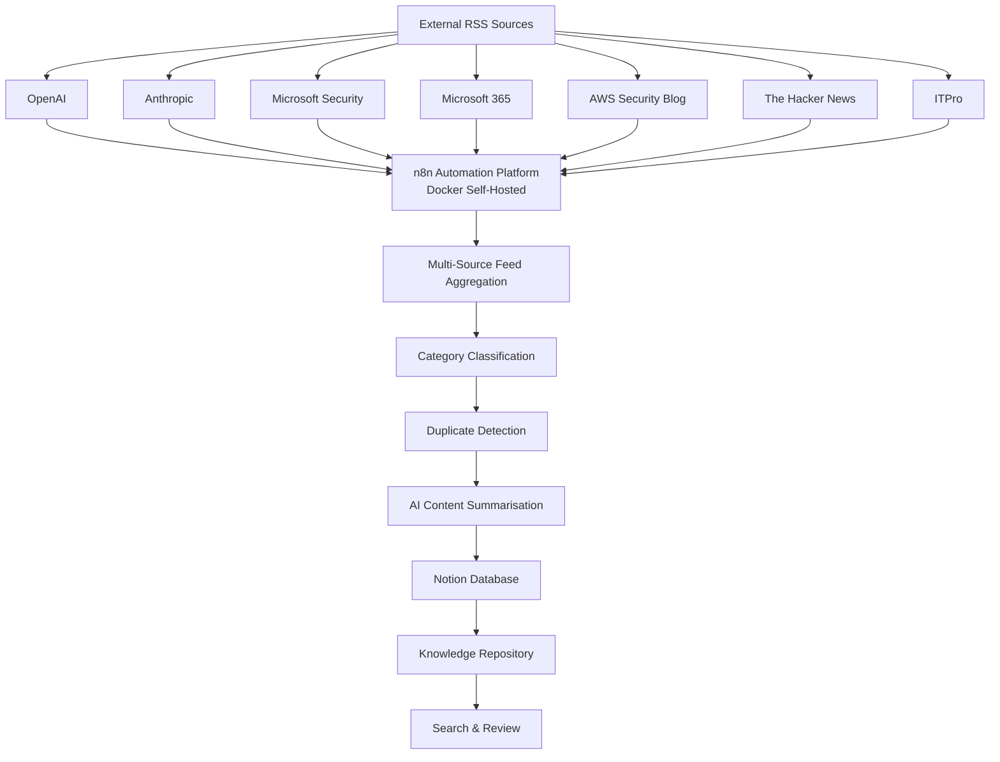

# AI-Powered Technology Intelligence Hub

```mermaid
flowchart TD

A[External RSS Sources]

A --> A1[OpenAI]
A --> A2[Anthropic]
A --> A3[Microsoft Security]
A --> A4[Microsoft 365]
A --> A5[AWS Security Blog]
A --> A6[The Hacker News]
A --> A7[ITPro]

A1 --> B
A2 --> B
A3 --> B
A4 --> B
A5 --> B
A6 --> B
A7 --> B

B[n8n Automation Platform<br/>Docker Self-Hosted]

B --> C[Multi-Source Feed Aggregation]

C --> D[Category Classification]

D --> E[Duplicate Detection]

E --> F[AI Content Summarisation]

F --> G[Notion Database]

G --> H[Knowledge Repository]

H --> I[Search & Review]
```